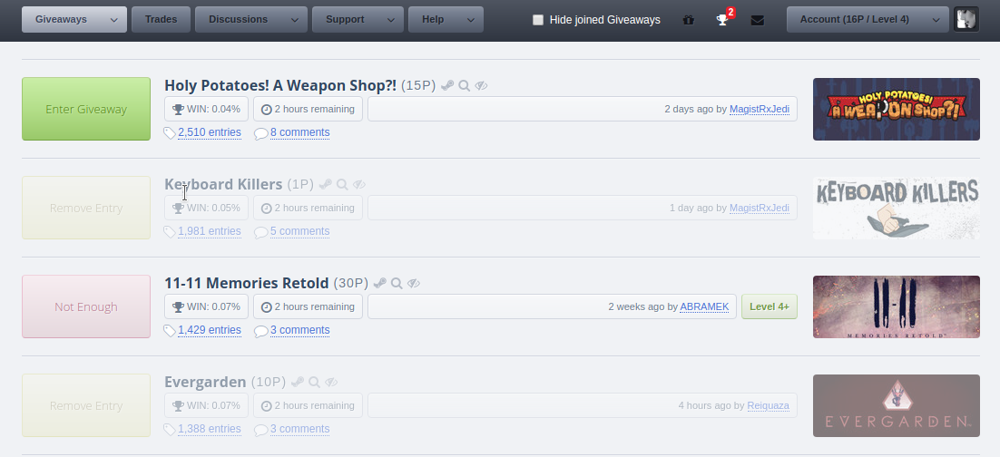

## PROJECT ##

* ID: **S**teamGifts!**J**OINER
* Contact: git@schepsen.eu

## DESCRIPTION ##

**S**teamGifts!**J**OINER helps you enter giveaways saving thousands of unnecessary clicks

### WHAT'S IMPLEMENTED?! ###

* Joining giveaways without opening them (1 Click only)
* Hiding&Showing of the entered GAs
* Infinity Page Scrolling
* Optimized UI (removed or/and reimplemented some UI elements)
* Estimating win probability for each Giveaway
* "Thank-You" function to leave a comment for a won GA (customizable)

## DEPENDENCIES ##

A userscript manager depending on your preference, e.g. [Tampermonkey](https://chrome.google.com/webstore/detail/tampermonkey/dhdgffkkebhmkfjojejmpbldmpobfkfo?hl=de)

## USAGE ##

Just load it into your userscript manager application

## SCREENSHOTS ##

## CHANGELOG ##

Legend: [**R**] Removed  [**F**] Fixed [**A**] Added [**I**] Information

### SteamGifts!JOINER 0.2.2, updated @ 2020-08-19 ###

* [R] unnecessary advertising DOM elements

### SteamGifts!JOINER 0.2.1, updated @ 2019-11-17 ###

* [F] small bugs and typos
* [A] function to "thank" the giveaway creator by adding a customizable comment

### SteamGifts!JOINER 0.2.0, updated @ 2019-10-29 ###

* [A] option to remove an entry
* [A] option to switch between "Hide-a-Giveaway" and "Remove-a-Giveaway" after joining it
* [A] infinite page scroll effect
* [A] static header positioned always on TOP
* [R] unnecessary UI elements
* [I] revised code and application structure

### SteamGifts!JOINER 0.1.0, updated @ 2019-10-08 ###

* Initial Release
